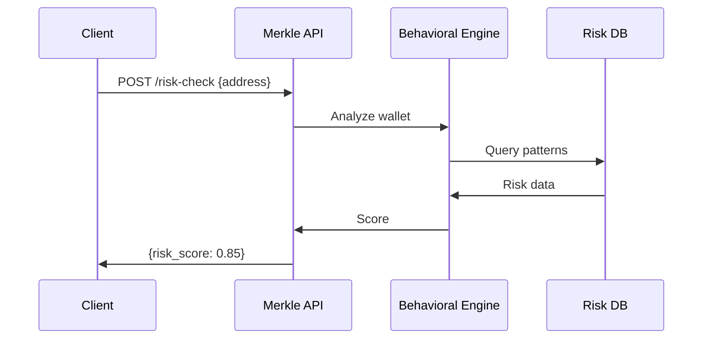

## Overview

Access Merkle Science's API to integrate advanced crypto threat detection directly into your applications. Use endpoints to query wallet risk scores, transaction profiles, and compliance data. All requests require authentication via Bearer token. Base URL: `https://api.merklescience.com/v1`.

<Callout kind="info">
  Generate your API key from the Merkle Science dashboard. Store it securely and never expose it in client-side code.
</Callout>

## Authentication

Authenticate requests by including your API key in the `Authorization` header as a Bearer token.

<ParamField header="Authorization" param-type="string" required="true">
  Bearer `{YOUR_API_KEY}`
</ParamField>

<ParamField header="Content-Type" param-type="string" required="true">
  `application/json`
</ParamField>

## Getting Started

Follow these steps to make your first API call.

<Steps>
  <Step title="Obtain API Key" icon="key">
    Log in to your Merkle Science account and navigate to API settings to generate a key.
  </Step>
  <Step title="Install Client" icon="download">
    <CodeGroup tabs="Node.js,Python">
      ```bash
      npm install axios
      ```
      ```bash
      pip install requests
      ```
    </CodeGroup>
  </Step>
  <Step title="Make Request" icon="play">
    Send a POST request to `/risk-check` with a wallet address.
  </Step>
</Steps>

## Core Endpoints

Discover key endpoints for crypto risk assessment.

<Columns cols={3}>
  <Card title="Risk Check" icon="shield" href="#risk-check">
    Assess wallet or transaction risk in real-time.
  </Card>
  <Card title="Wallet Profile" icon="wallet" href="#wallet-profile">
    Retrieve detailed behavioral profiles.
  </Card>
  <Card title="Transaction Trace" icon="search" href="#transaction-trace">
    Track fund flows and entity relationships.
  </Card>
</Columns>

## Risk Check Endpoint

Query the risk level of a cryptocurrency wallet or transaction hash.

### Request Format

```
POST https://api.merklescience.com/v1/risk-check
```

<Request tabs="cURL,JavaScript,Python" show-lines="true">
  ```bash
  curl -X POST https://api.merklescience.com/v1/risk-check \
    -H "Authorization: Bearer YOUR_API_KEY" \
    -H "Content-Type: application/json" \
    -d '{
      "address": "bc1qxy2kgdygjrsqtzq2n0yrf2493p83kkfjhx0wlh",
      "currency": "BTC"
    }'
  ```

  ```javascript
  const axios = require('axios');

  const response = await axios.post('https://api.merklescience.com/v1/risk-check', {
    address: 'bc1qxy2kgdygjrsqtzq2n0yrf2493p83kkfjhx0wlh',
    currency: 'BTC'
  }, {
    headers: {
      'Authorization': 'Bearer YOUR_API_KEY',
      'Content-Type': 'application/json'
    }
  });
  ```

  ```python
  import requests

  response = requests.post(
      'https://api.merklescience.com/v1/risk-check',
      json={
          'address': 'bc1qxy2kgdygjrsqtzq2n0yrf2493p83kkfjhx0wlh',
          'currency': 'BTC'
      },
      headers={
          'Authorization': 'Bearer YOUR_API_KEY',
          'Content-Type': 'application/json'
      }
  )
  ```
</Request>

### Parameters

<ParamField body="address" param-type="string" required="true">
  Cryptocurrency wallet address to assess.
</ParamField>

<ParamField body="currency" param-type="string" required="true">
  Currency code, e.g., `BTC`, `ETH`.
</ParamField>

<ParamField body="transaction_hash" param-type="string" required="false">
  Optional transaction hash for flow analysis.
</ParamField>

### Response Format

<Response tabs="200,400">
  ```json
  {
    "risk_score": 0.85,
    "risk_level": "high",
    "reasons": ["Associated with mixer service", "Recent high-velocity transfers"],
    "compliance_flags": ["sanctions_match", "illicit_category"]
  }
  ```

  ```json
  {
    "error": "Invalid address format",
    "code": "INVALID_INPUT"
  }
  ```
</Response>

<ResponseField name="risk_score" field-type="number" required="true">
  Score from 0.0 (low risk) to 1.0 (high risk).
</ResponseField>

<ResponseField name="risk_level" field-type="string" required="true">
  `low`, `medium`, or `high`.
</ResponseField>

<ResponseField name="reasons" field-type="array" required="false">
  Array of risk indicators.
</ResponseField>

## Rate Limiting

Merkle Science enforces rate limits to ensure fair usage.

| Limit | Requests per Minute | Burst |
|-------|---------------------|-------|
| Free Tier | 60 | 120 |
| Pro Tier | 600 | 1200 |
| Enterprise | Custom | Custom |

Exceeding limits returns HTTP 429. Implement exponential backoff.

<Callout kind="tip">
  Monitor your usage via the dashboard's API analytics tab.
</Callout>

## Error Handling

Handle common errors gracefully.

<Tabs>
  <Tab title="401 Unauthorized" icon="alert-triangle">
    Verify your `{YOUR_API_KEY}` and regenerate if compromised.
  </Tab>
  <Tab title="429 Rate Limit" icon="clock">
    Retry after `Retry-After` header seconds.
  </Tab>
  <Tab title="500 Internal" icon="server">
    Contact support@merkle.science with request ID.
  </Tab>
</Tabs>

## API Flow



Integrate these endpoints to power your compliance workflows and stay ahead of crypto threats.