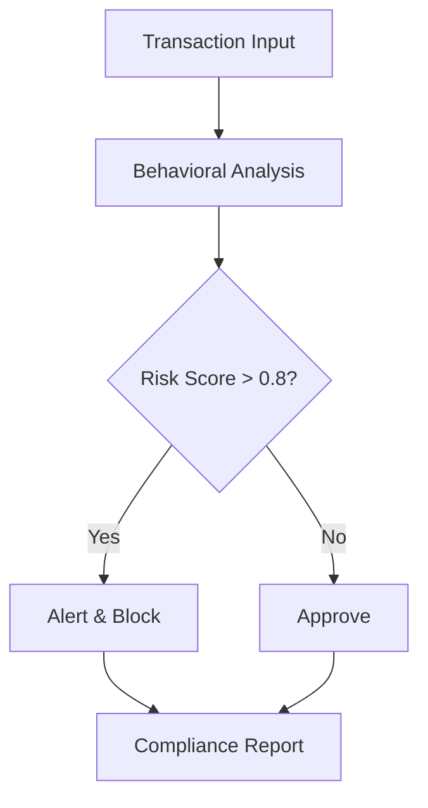

## Overview

Merkle Science delivers predictive crypto risk and intelligence platforms that help you detect threats, manage risks, and ensure compliance in the cryptocurrency ecosystem. Founded in 2018, the company empowers crypto businesses, financial institutions, and government agencies to combat illicit activities using advanced tools beyond traditional blacklists. You gain actionable insights through their proprietary Behavioral Rule Engine, enabling proactive KYC/AML compliance.

<Callout kind="info">
  Merkle Science processes billions of transactions daily to stay ahead of sophisticated crypto threats.
</Callout>

## Company Background

<Expandable title="Founding and Growth" default-open="true">
  Established in 2018, Merkle Science quickly became a leader in crypto intelligence. The team combines expertise in blockchain analytics, machine learning, and regulatory compliance to address the unique challenges of digital assets. Today, it serves global clients, supporting safe crypto adoption within the `$22 trillion` financial services industry.
</Expandable>

## Core Mission

You protect your operations from crypto risks while fostering industry growth. Merkle Science's mission focuses on compliance and risk management, helping you meet local KYC/AML requirements. Detect and prevent money laundering, sanctions evasion, and other illicit flows before they impact your business.

## Key Solutions

Explore the platform's core offerings through these feature cards.

<Columns cols={3}>
  <Card title="Threat Detection" icon="shield" href="/docs/threat-detection">
    Identify high-risk wallets and transactions in real-time using behavioral analysis.
  </Card>
  <Card title="Risk Scoring" icon="trending-up" href="/docs/risk-scoring">
    Assign dynamic risk scores to addresses, enabling automated decision-making.
  </Card>
  <Card title="Compliance Monitoring" icon="check-circle" href="/docs/compliance">
    Automate AML/KYC checks with customizable rules tailored to your jurisdiction.
  </Card>
</Columns>

## Target Users

<Tabs>
  <Tab title="Crypto Businesses" icon="package">
    Exchanges and DeFi platforms use Merkle Science to screen users and transactions, reducing exposure to illicit funds.
    
    <Callout kind="tip">
      Integrate via API for seamless on-chain monitoring.
    </Callout>
  </Tab>
  
  <Tab title="Financial Institutions" icon="banknote">
    Banks and fintechs monitor crypto inflows/outflows to maintain regulatory compliance and mitigate risks.
  </Tab>
  
  <Tab title="Government Agencies" icon="shield">
    Law enforcement leverages intelligence reports to investigate and disrupt criminal networks.
  </Tab>
</Tabs>

## How It Works

Follow these steps to implement Merkle Science in your workflow.

<Steps>
  <Step title="Sign Up" icon="user-plus">
    Create an account and obtain your API key.
  </Step>
  
  <Step title="Integrate API" icon="code">
    Query wallet addresses for risk assessments.
    
    <CodeGroup tabs="JavaScript,Python">
      ```javascript
      const response = await fetch('https://api.merklescience.com/v1/risk/score', {
        method: 'POST',
        headers: {
          'Authorization': `Bearer ${YOUR_API_KEY}`,
          'Content-Type': 'application/json'
        },
        body: JSON.stringify({
          address: 'bc1qxy2kgdygjrsqtzq2n0yrf2493p83kkfjhx0wlh'
        })
      });
      const data = await response.json();
      console.log(data.riskScore);
      ```
      
      ```python
      import requests
      
      response = requests.post(
          'https://api.merklescience.com/v1/risk/score',
          headers={
              'Authorization': f'Bearer {YOUR_API_KEY}',
              'Content-Type': 'application/json'
          },
          json={'address': 'bc1qxy2kgdygjrsqtzq2n0yrf2493p83kkfjhx0wlh'}
      )
      data = response.json()
      print(data['riskScore'])
      ```
    </CodeGroup>
  </Step>
  
  <Step title="Review Insights" icon="bar-chart">
    Analyze reports and set up alerts for high-risk activities.
  </Step>
</Steps>



## Vision for Crypto Growth

Merkle Science envisions a world powered by safe cryptocurrency. You build infrastructure that enables secure transactions for individuals, businesses, and services. By staying ahead of threats, you contribute to sustainable expansion in the crypto economy. Start integrating today to safeguard your operations.